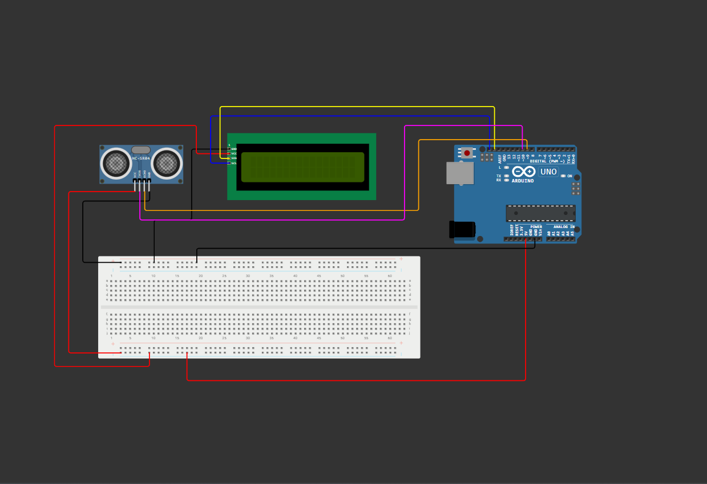

# 📏 Ultrasonic Distance Measurement using I2C LCD

This Arduino project measures the distance of an object using the **HC-SR04 Ultrasonic Sensor** and displays real-time readings on a **16x2 I2C LCD**.
It also shows an **“Out of Range”** alert when no echo is detected.

---

## 🧠 Features

* 📟 Real-time distance measurement in centimeters
* ⚡ “Out of Range” detection when no echo is received
* 🧩 Simple wiring using I2C for compact design
* 🧾 Serial Monitor support for debugging
* 💡 LCD automatically updates without flickering

---

## 🧰 Components Required

| Component                 | Quantity | Description                              |
| ------------------------- | -------- | ---------------------------------------- |
| Arduino Uno               | 1        | Microcontroller board                    |
| HC-SR04 Ultrasonic Sensor | 1        | Measures distance using ultrasonic waves |
| 16x2 I2C LCD              | 1        | Displays distance readings               |
| Jumper Wires              | —        | For circuit connections                  |

---

## ⚙️ Circuit diagram


## ⚙️ Circuit Connections

| Module  | Pin  | Arduino Pin |
| ------- | ---- | ----------- |
| HC-SR04 | VCC  | 5V          |
| HC-SR04 | GND  | GND         |
| HC-SR04 | TRIG | D9          |
| HC-SR04 | ECHO | D10         |
| I2C LCD | SDA  | SDA         |
| I2C LCD | SCL  | SCL         |

---

## 💻 Libraries Used

* `Wire.h` — For I2C communication
* `LiquidCrystal_I2C.h` — To control the LCD with I2C interface

Install via **Library Manager** in Arduino IDE:

```
Sketch → Include Library → Manage Libraries → Search "LiquidCrystal I2C"
```

---

## 🔢 Code Overview

* Sends a **10µs trigger pulse** to the ultrasonic sensor
* Measures the **echo time** using `pulseIn()`
* Converts echo duration to **distance (cm)**
* Displays the distance on LCD and Serial Monitor
* If no echo is received, it shows **“Out of Range”**

---

## 📺 Sample LCD Output

```
Distance: 23.4cm
```

or

```
Out of range
```

---


